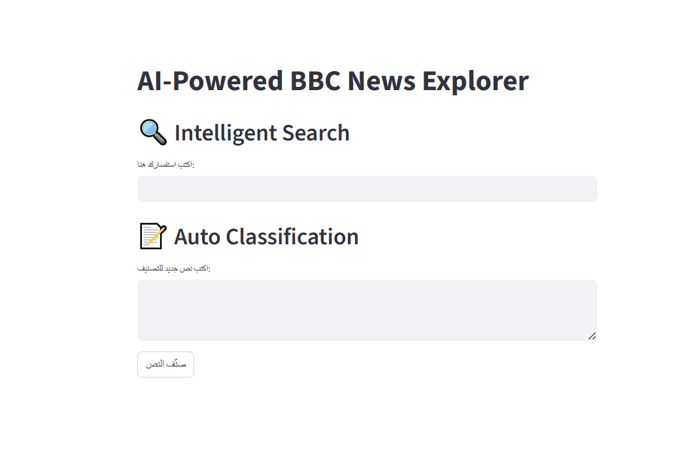
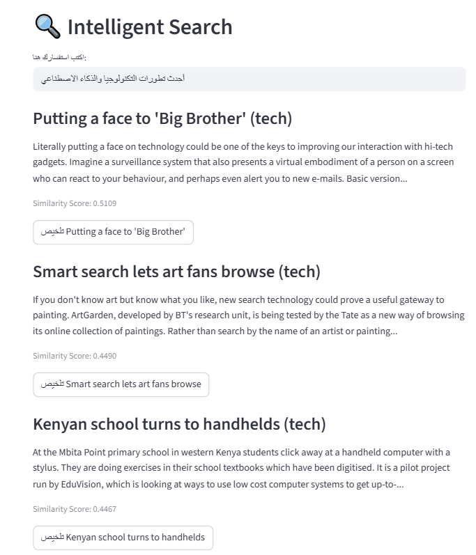
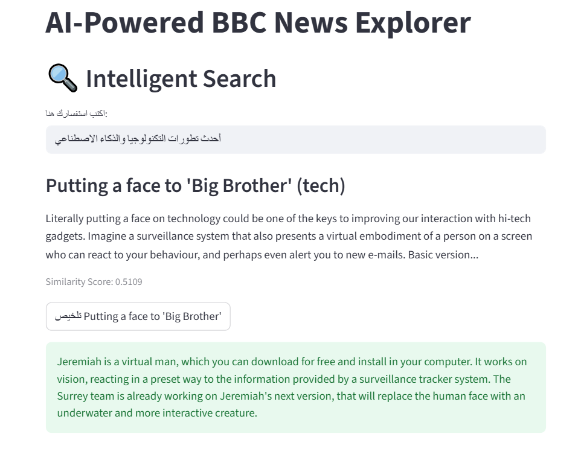
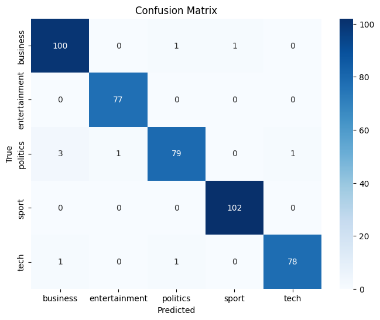

# AI-Powered-BBC-News-Explorer
An interactive AI web app built with Streamlit that enables:
* **Semantic Search:** Find the most relevant BBC news articles to your query (supports Arabic & English).
* **Auto Classification:** Classify new articles into categories (trained on BBC dataset with Logistic Regression).
* **Summarization:** Generate concise summaries of long news articles.
* **Translation Layer:** Added deep-translator so that Arabic inputs are automatically translated before classification by Logistic Regression.
---

## 📂 Dataset Overview
This project is built on the **BBC News Dataset**, which contains hundreds of news articles from the BBC.  
Each article has:
- **Title** → short headline of the article.  
- **Content** → full news text.  
- **Category** → one of the 5 main classes:
  - `business`
  - `entertainment`
  - `politics`
  - `sport`
  - `tech`

---

## 🔎 Intelligent Search (Semantic Search)
Traditional keyword search only matches exact words.  
This system uses **Sentence-BERT embeddings** to enable **semantic search**:
- You can ask a question in **English or Arabic**.
- The model converts your query into a vector (semantic meaning).
- It compares your query with all article vectors.
- Returns the **most relevant news articles**, even if the wording is different.

📝 Example:
- Query: *"منظمة الصحة العالمية تحذر من وباء"*  
- The system retrieves articles about *"WHO warns of global pandemic"* → even though the words differ.

---

## ✂️ Summarization
News articles can be very long.  
The system uses a **BART-large-cnn model** to generate **short summaries**:
- Summarization is done in **English** (as dataset is in English).
- Helps readers get the **main idea in 3–4 sentences**.
- Useful for scanning large reports quickly.

📝 Example:
- Original article: ~1000 words on *"climate change policies"*.  
- Generated summary: *"The government announced new climate initiatives focusing on renewable energy and emission cuts."*

---

## 📝 Auto Classification
the system can **automatically classify new articles**.  
It uses a **TF-IDF Vectorizer** + **Logistic Regression** trained on the BBC dataset.  

- Categories available:
  - `business`
  - `entertainment`
  - `politics`
  - `sport`
  - `tech`

- Works mainly with **English articles**, but with the added **translation layer**, Arabic text is auto-translated before classification.  

📝 Example:
- Input: *"The football team won the championship yesterday."*  
- Prediction: `sport`  

- Input: *"أعلنت الحكومة عن سياسات تعليمية جديدة"*  
- Translated → *"The government announced new education policies"*  
- Prediction: `politics`

---

## Project Structure
### AI-Powered BBC News Explorer
* app.py                     # Streamlit app (main interface)
*  requirements.txt           # Dependencies to install
*  bbc-news-data.csv          # Dataset (BBC News, cleaned)
*   classifier_model.pkl       # Trained Logistic Regression model
*   tfidf_vectorizer.pkl       # TF-IDF vectorizer used with model
  ###   notebook
*    bbc_nlp_pipeline.ipynb
### images                  
* ui_home.png
*  classification_result.png
---
   ## Models & Components
* **Sentence-BERT (MiniLM-L12-v2)** → used for semantic search (supports multilingual queries).  
* **Summarizer (BART-large-cnn)** → used for generating summaries (English).  
* **Logistic Regression Classifier** → trained on BBC News dataset (English-only categories).  
* **TF-IDF Vectorizer** → converts cleaned text into numerical features.  
* **Deep Translator** → supports Arabic input by auto-translating before classification.  
---
 
 ## How to Run Locally
1. **Clone repository:**
   ```bash git clone https://github.com/<your-username>/AI-Powered-BBC-News-Explorer.git cd AI-Powered-BBC-News-Explorer```
2. **Create virtual environment (recommended):**
```python -m venv .venv .venv\Scripts\activate   # On Windows```
 ```source .venv/bin/activate  # On Mac/Linux```
4. **Install requirements:**
```pip install -r requirements.txt```
5. **Run the app:**
```streamlit run app.py```
---

## 🔍 Example Queries

**Arabic (translated automatically):**
<p align="left">
  - "من فاز في مباراة كرة القدم الأخيرة؟" → classified as sport  
  - "أسعار النفط وتأثيرها على الاقتصاد" → classified as business 


</p>

**English:**
- "Prime minister announced new education policies" → classified as **politics**
- "Stock market faced a huge drop due to oil prices" → classified as **business**

---
## Results
* Logistic Regression achieved ~97% accuracy on the test split.
* Confusion matrix & classification report are included in the notebook (notebook/bbc_nlp_pipeline.ipynb).
* Summarization reduces long articles into 3–4 sentences for quick reading.
---
## Features Roadmap
 1. Add video/audio content support via speech-to-text (future).
 2. Enhance Arabic summarization with multilingual models.
 3. Deploy on HuggingFace Spaces or Streamlit Cloud for public demo.

    ---
  ## Screenshots

   ### 🖥️ Web App Interface
* 

#### Semantic Search
*   

  #### Summarization
*    

#### Classification
*    


  ### 📊 Model Accuracy (Logistic Regression)
* 

